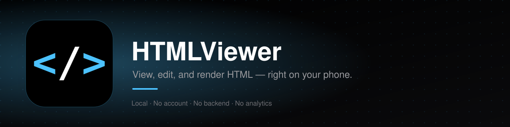
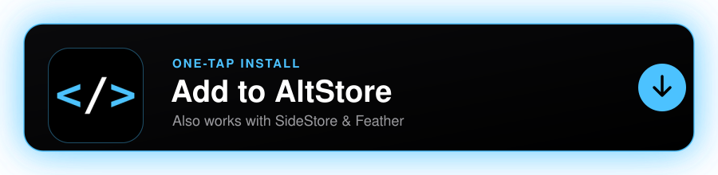

<p align="center">
  
</p>

<p align="center">
  
  
  
  
  
  
</p>

<p align="center">
  
  
  
  
  
</p>

Sometimes you just want to open an HTML file on your phone, tweak a line, and see what changes without emailing it to yourself or dragging a laptop into it. Files app can't render HTML, and there's no lightweight way to edit and preview a page side by side. HTMLViewer is that: a small, local, no-account, no-backend app for viewing and editing HTML files on iOS.

Everything runs on-device. There's no server, no analytics, no account. The only thing HTMLViewer will ever reach out to the internet for is an *optional*, manual check against this repo's GitHub releases from the Settings tab — nothing else, ever.

<p align="center">
  <a href="altstore://source?url=https://raw.githubusercontent.com/xsxs18-dev/HTMLViewer/main/altstore-source.json">
    
  </a>
</p>

<p align="center">On-device, tap the card above. In SideStore, Feather, or anywhere else that asks for a source URL, copy exactly this link — <strong>not</strong> the address of this GitHub page:</p>

<p align="center"><code>https://raw.githubusercontent.com/xsxs18-dev/HTMLViewer/main/altstore-source.json</code></p>

## Contents

- [What it does](#what-it-does)
- [Getting it running](#getting-it-running)
  - [Add it to AltStore, SideStore, or Feather](#add-it-to-altstore-sidestore-or-feather)
  - [Download and sign manually](#download-and-sign-manually)
  - [Build from source](#build-from-source)
- [How it's built](#how-its-built)
- [Known rough edges](#known-rough-edges)
- [License](#license)

## What it does

**Browse and organize** — create folders, create new HTML pages from a blank template, import existing files from Files or iCloud Drive, rename, delete, multi-select.

**View and edit in one place** — tap a page to see it rendered in a real WebView. Tap Edit to drop into the raw HTML source, tap Preview to save and see the result immediately. No separate editor app, no round trip.

**Same look as my other apps** — same design system as [FileManager](https://github.com/xsxs18-dev/FileManager): four built-in themes (light blue/black, red/black, light blue/white, red/white), same spacing and type scale.

**Changelog and version, right in Settings** — the current version and build number are shown in Settings, along with a Changelog screen that pulls every past release's notes straight from GitHub. A manual "Check for Updates" button is there too.

## Getting it running

### Add it to AltStore, SideStore, or Feather

This is the easiest way, and the only one where updates find you automatically instead of the other way around. HTMLViewer publishes itself as an [AltStore](https://altstore.io/) source — add it once, and every new release shows up as an update in the app, no GitHub visits required.

[**Tap to add the source directly**](altstore://source?url=https://raw.githubusercontent.com/xsxs18-dev/HTMLViewer/main/altstore-source.json) if you're reading this on the device you want to install to. Otherwise, add it manually — in AltStore that's **Browse → Sources → Add Source**; in SideStore or Feather, look for **Add Source** / **Repos** — and paste exactly this URL:

```
https://raw.githubusercontent.com/xsxs18-dev/HTMLViewer/main/altstore-source.json
```

> Note: this only works with **AltStore Classic** and its compatible clients (SideStore, Feather), not **AltStore PAL** — PAL requires every app to pass Apple's notarization process under a paid Apple Developer account, which is exactly what this project avoids needing.

### Download and sign manually

Every push to `main` builds an **unsigned** `.ipa` on GitHub Actions and publishes it straight to a new [Release](https://github.com/xsxs18-dev/HTMLViewer/releases) — one release per build, tagged `build-N`, with the raw `.ipa` attached as a downloadable asset. Grab the latest one and sign it with your own free (or paid) Apple ID using [Sideloadly](https://sideloadly.io/) or [AltStore](https://altstore.io/).

### Build from source

You'll need a Mac with Xcode and [XcodeGen](https://github.com/yonaskolb/XcodeGen) (the `.xcodeproj` isn't committed — it's generated from `project.yml`):

```bash
brew install xcodegen
git clone https://github.com/xsxs18-dev/HTMLViewer.git
cd HTMLViewer
xcodegen generate
open HTMLViewer.xcodeproj
```

Set your own signing team in Xcode and build to a device.

## How it's built

<p>
  
  
  
  
</p>

| | |
|---|---|
| UI | SwiftUI throughout |
| HTML rendering | `WKWebView`, loading the file's own content with its own directory as the base URL so relative links and local assets work |
| Editing | A plain monospaced text editor over the raw file, no syntax highlighting yet |
| Localization | a String Catalog (`Localizable.xcstrings`), English source + German |

<details>
<summary><strong>Project layout</strong></summary>

```
HTMLViewer/
├── App/            entry point
├── DesignSystem/   colors, spacing, type, theme definitions, shared styles
├── Models/         PageItem
├── Services/       FileSystemService, ThemeManager, UpdateChecker
├── Views/          file browser, preview/edit screen, Settings, Changelog
└── Resources/      Assets.xcassets, Info.plist, Localizable.xcstrings

project.yml         XcodeGen project definition
.github/workflows/  CI — builds an unsigned .ipa and cuts a GitHub Release for every push
```

</details>

## Known rough edges

<details>
<summary>Click to expand</summary>

- No Share Sheet support yet, either direction.
- No syntax highlighting in the editor — it's a plain text box.
- Only top-level HTML rendering; if a page pulls in resources from outside its own folder, they won't load.
- No iPad-specific layout yet.

</details>

This is a small side project, still early. Contributions and bug reports welcome.

## License

MIT — see [LICENSE](LICENSE). Do whatever you want with it.
